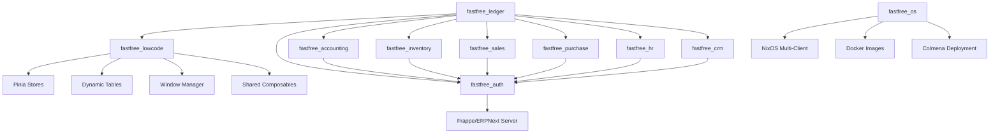

# FastFree ERP

> Modular ERP platform built with Quasar, Vue 3, TypeScript, and Frappe/ERPNext backend — deployed as NixOS multi-client systems.

[](https://opensource.org/licenses/MIT)
[](https://vuejs.org/)
[](https://www.typescriptlang.org/)
[](https://quasar.dev/)
[](https://nixos.org/)
[](https://github.com/FastFreeCloud/fastfree/actions/workflows/build-os.yaml)

## Table of Contents

- [Overview](#overview)
- [Architecture](#architecture)
- [Packages](#packages)
- [Applications](#applications)
- [Quick Start](#quick-start)
- [Development](#development)
- [Boot Order](#boot-order)
- [CI/CD Pipeline](#cicd-pipeline)
- [NixOS Deployment](#nixos-deployment)
- [Quality](#quality)
- [Contributing](#contributing)
- [License](#license)

## Overview

FastFree ERP is a modular enterprise resource planning system composed of independent npm packages in a pnpm monorepo. Each package handles a specific business domain (accounting, inventory, sales, etc.) and can be developed, tested, and versioned independently.

The system runs on NixOS with multi-client deployment support (WSL, Hyper-V, Hostainer) and is built and tested entirely via GitHub Actions.

**Key Technologies:**
- **Frontend:** Vue 3 + Quasar Framework + Pinia
- **Language:** TypeScript (strict mode)
- **Build:** Vite (via Quasar CLI)
- **Backend:** Frappe Framework / ERPNext
- **Package Manager:** pnpm workspaces
- **Database:** IndexedDB (Dexie) for offline caching
- **Deployment:** NixOS + Colmena + Docker (GHCR)
- **CI/CD:** GitHub Actions (4 workflows, 16 jobs)

## Architecture



## Packages

| Package | Description | Screens | Services | i18n Keys |
|---------|-------------|---------|----------|-----------|
| [`fastfree_lowcode`](packages/fastfree_lowcode) | Core engine — window manager, CRUD table, dynamic forms, shared composables | 12 | — | 383 |
| [`fastfree_auth`](packages/fastfree_auth) | Authentication, user management, roles, licensing | 5 | 3 | 131 |
| [`fastfree_accounting`](packages/fastfree_accounting) | Chart of accounts, journal entries, payments, cost centers, fiscal years, reports | 8 | 7 | 117 |
| [`fastfree_inventory`](packages/fastfree_inventory) | Products, categories, warehouses, stock entries, suppliers | 8 | 5 | 80 |
| [`fastfree_sales`](packages/fastfree_sales) | Customers, quotations, sales orders, invoices, delivery notes | 7 | 6 | 150 |
| [`fastfree_purchase`](packages/fastfree_purchase) | Suppliers, purchase orders, receipts, invoices | 7 | 5 | 140 |
| [`fastfree_hr`](packages/fastfree_hr) | Employees, departments, attendance, leave, payroll | 7 | 9 | 114 |
| [`fastfree_crm`](packages/fastfree_crm) | Leads, opportunities, contacts, campaigns | 6 | 8 | 108 |
| **Total** | | **60** | **43** | **1,253** |

## Applications

| App | Path | Description |
|-----|------|-------------|
| [`fastfree_ledger`](apps/fastfree_ledger) | `apps/fastfree_ledger/` | Main Quasar app — the ERP frontend |
| [`fastfree_backend`](apps/fastfree_backend) | `apps/fastfree_backend/` | Frappe custom app (scaffold) |
| [`fastfree_os`](apps/fastfree_os) | `apps/fastfree_os/` | NixOS deployment — multi-client builds, VM tests, CLI |

## Quick Start

### Prerequisites

- Node.js >= 18
- pnpm >= 9
- Frappe/ERPNext server (for API calls)

### Installation

```bash
# Clone the repository
git clone https://github.com/FastFreeCloud/fastfree.git
cd fastfree

# Install dependencies
pnpm install

# Start development server (port 9001)
cd apps/fastfree_ledger
pnpm dev
```

### Using a Package

```typescript
// Import services
import { getAccounts, createJournalEntry } from 'fastfree-accounting'

// Import types
import type { Account, JournalEntry } from 'fastfree-accounting'

// Import store
import { useAccountingStore } from 'fastfree-accounting'

// Import shared utilities
import { useFormatNumber, useStatusHelpers } from 'fastfree-lowcode'
```

## Development

### Commands

```bash
# From the monorepo root
cd apps/fastfree_ledger

# Development server (port 9001)
pnpm dev

# TypeCheck — must be 0 errors
pnpm vue-tsc --noEmit

# Lint — must be 0 violations
pnpm eslint -c ./eslint.config.js "./src*/**/*.{ts,js,mjs,cjs,vue}"

# Lint + Auto Fix
pnpm eslint -c ./eslint.config.js "./src*/**/*.{ts,js,mjs,cjs,vue}" --fix
```

### Project Structure

```
fastfree/
├── apps/
│   ├── fastfree_ledger/          # Main Quasar application
│   │   ├── src/
│   │   │   ├── boot/             # Boot files (init each package)
│   │   │   ├── pages/            # Vue pages
│   │   │   └── ...
│   │   ├── quasar.config.ts
│   │   └── package.json
│   ├── fastfree_backend/         # Frappe custom app (scaffold)
│   └── fastfree_os/              # NixOS deployment system
│       ├── flake.nix             # Nix Flake — builds + tests
│       ├── nix/
│       │   ├── options.nix       # Configuration options
│       │   ├── colmena.nix       # Colmena deployment
│       │   ├── cli.nix           # CLI commands
│       │   ├── clients/          # Client configurations
│       │   └── modules/          # NixOS service modules
│       └── scripts/              # PowerShell setup scripts
├── packages/
│   ├── fastfree_lowcode/         # Core engine
│   ├── fastfree_auth/            # Authentication
│   ├── fastfree_accounting/      # Accounting module
│   ├── fastfree_inventory/       # Inventory module
│   ├── fastfree_sales/           # Sales module
│   ├── fastfree_purchase/        # Purchase module
│   ├── fastfree_hr/              # HR module
│   └── fastfree_crm/             # CRM module
├── .github/workflows/
│   ├── build-os.yaml             # Main CI/CD — builds + tests + release
│   ├── build-ledger.yaml         # Ledger Docker image
│   ├── build-backend.yaml        # Backend Docker image
│   └── build-frappe.yaml         # Frappe app creation
├── pnpm-workspace.yaml
└── AGENTS.md
```

## Boot Order

Packages must be initialized in a specific order:

```
1. fastfree-auth-init         → API client + auth
2. fastfree-accounting-init   → Accounting groups + screens
3. fastfree-inventory-init    → Inventory groups + screens
4. fastfree-sales-init        → Sales groups + screens
5. fastfree-purchase-init     → Purchase groups + screens
6. fastfree-hr-init           → HR groups + screens
7. fastfree-crm-init          → CRM groups + screens
8. i18n                       → Translations loaded
9. register-service-worker    → PWA registration
```

## CI/CD Pipeline

The project uses 4 GitHub Actions workflows with 16 total jobs:

### build-os.yaml (11 jobs)

Triggers on push to `main`/`master` when NixOS files change:

```
Phase 1 — Fast checks (parallel, seconds):
  ├── syntax_check      — Validate all .nix files
  ├── nix_lint          — statix + deadnix (optional)
  ├── flake_validate    — Flake structure + metadata
  └── evaluation        — Evaluate all NixOS configurations

Phase 2 — Build & test (parallel, minutes):
  ├── dry_build         — Build plan without building
  ├── build_packages    — Build WSL + VHDX archives
  ├── build_backend_image  — Docker image (reusable workflow)
  ├── build_ledger_image   — Docker image (reusable workflow)
  └── service_tests     — 9 NixOS VM tests

Phase 3 — Report & release:
  ├── test_report       — Markdown summary + GitHub Summary
  └── release           — GitHub Release with archives
```

### build-ledger.yaml (3 jobs)
- `lint` → `build-frontend` → `release`
- Builds Docker image via Nix + pushes to GHCR

### build-backend.yaml (1 job)
- Builds Frappe Docker image via BuildKit
- Pushes to GHCR with semantic versioning

### build-frappe.yaml (1 job)
- Manual trigger only — creates new Frappe apps

## NixOS Deployment

### Clients

| Client | Type | Build | Services |
|--------|------|-------|----------|
| `client1` | WSL | `fastfree_client1.wsl.7z` | All |
| `client2` | Hyper-V | `fastfree_client2.vhdx.7z` | All |
| `client3` | Hostainer | SSH deployment | All |

### Services

Each client runs:
- **base** — NixOS fundamentals + CLI
- **mariadb** — Database
- **fastfree_backend** — Frappe/ERPNext container
- **fastfree_ledger** — Quasar frontend container
- **phpmyadmin** — Database management
- **caddy** — Reverse proxy
- **wireguard** — VPN
- **avahi** — mDNS discovery

### VM Tests (9 tests)

```
✅ mariadb        — Database service
✅ wireguard      — VPN connectivity
✅ sshd           — SSH access
✅ phpmyadmin     — Web database UI
✅ podman         — Container runtime
✅ fastfree_backend — Backend container
✅ fastfree_ledger  — Frontend container
✅ avahi          — mDNS discovery
✅ multi_client   — All services together
```

### CLI Commands

```bash
# Inside WSL
fastfree update      # Update system
fastfree rebuild     # Rebuild configuration
fastfree status      # Show system status
fastfree backup      # Create backup
fastfree login       # Login to services
fastfree doctor      # Health check
fastfree version     # Show version
```

## Quality

| Metric | Target | Status |
|--------|--------|--------|
| TypeScript Errors | 0 | ✅ |
| ESLint Violations | 0 | ✅ |
| ESLint Warnings | 0 | ✅ |
| Screen Count | 60 | ✅ |
| Service Count | 43 | ✅ |
| i18n Keys | 1,253 | ✅ |
| NixOS VM Tests | 9/9 | ✅ |
| CI/CD Workflows | 4 | ✅ |

### Shared Utilities

The `fastfree-lowcode` package provides shared composables:

- **`useFormatNumber()`** — Locale-aware number, currency, and percentage formatting
- **`useStatusHelpers(namespace)`** — Status translation, color mapping, and options generation

```typescript
import { useFormatNumber, useStatusHelpers } from 'fastfree-lowcode'

const { formatNumber, formatCurrency } = useFormatNumber()
const { translateStatus, statusColor } = useStatusHelpers('sales')
```

## Contributing

1. Create a feature branch from `main`
2. Make your changes in the relevant package
3. Ensure `pnpm vue-tsc --noEmit` passes with 0 errors
4. Ensure `pnpm eslint` passes with 0 violations
5. Update the package's `AGENTS.md` and `README.md`
6. Submit a pull request

### Code Standards

- **TypeScript strict mode** — no `any` types, exact optional properties
- **Named exports only** — no default exports for services
- **try/catch** — all async operations must handle errors
- **i18n** — all user-facing text must use `t()` calls
- **ARIA** — all interactive elements must have `aria-label`
- **No console.log** — use proper error handling

## License

MIT — FastFree
