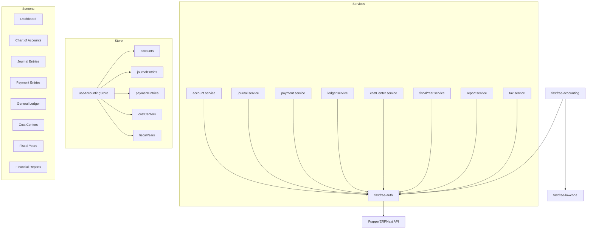

# @fastfree/accounting

> Full accounting suite for FastFree ERP — Chart of Accounts, Journal Entries, Payments, Cost Centers, Fiscal Years, Financial Reports.

[](https://opensource.org/licenses/MIT)

## Table of Contents

- [Features](#features)
- [Install](#install)
- [Quick Start](#quick-start)
- [Architecture](#architecture)
- [Services](#services)
- [Types](#types)
- [Screens](#screens)
- [Store](#store)
- [Configuration](#configuration)
- [Contributing](#contributing)
- [License](#license)

## Features

- **Chart of Accounts** — Hierarchical tree with drag-and-drop, search, and filtering
- **Journal Entries** — Double-entry bookkeeping with submit/cancel workflow
- **Payment Entries** — Pay, Receive, and Internal Transfer with auto-journal posting
- **General Ledger** — Account-wise transaction history with date range filtering
- **Cost Centers** — Departmental budget tracking with parent-child hierarchy
- **Fiscal Years** — Year management with open/close workflow
- **Financial Reports** — Trial Balance, Profit & Loss, Balance Sheet, Accounts Receivable/Payable
- **Tax Templates** — VAT, Withholding Tax, and Custom tax rules with auto-calculation

## Install

```bash
# Using pnpm (recommended for monorepo)
pnpm add fastfree-accounting

# Using npm
npm install fastfree-accounting
```

### Peer Dependencies

| Package | Version | Required |
|---------|---------|----------|
| `fastfree-auth` | `workspace:*` | Yes |
| `fastfree-lowcode` | `workspace:*` | Yes |
| `pinia` | `^2.0.0` | Yes |
| `quasar` | `^2.0.0` | Yes |
| `vue` | `^3.4.0` | Yes |

## Quick Start

### 1. Register the boot file

```typescript
// src/boot/fastfree-accounting-init.ts
import { initAccounting } from 'fastfree-accounting'

export default async () => {
  await initAccounting()
}
```

### 2. Add to quasar.config.ts

```typescript
// quasar.config.ts
export default defineConfig({
  boot: [
    'fastfree-auth-init',
    'fastfree-accounting-init',  // ← add after auth
    // ...
  ],
})
```

### 3. Use services in a component

```vue
<script setup lang="ts">
import { ref, onMounted } from 'vue'
import { getAccounts, createJournalEntry } from 'fastfree-accounting'
import type { Account, JournalEntry } from 'fastfree-accounting'

const accounts = ref<Account[]>([])

onMounted(async () => {
  const result = await getAccounts()
  if (result.success) {
    accounts.value = result.data || []
  }
})
</script>
```

### 4. Use the Pinia store

```vue
<script setup lang="ts">
import { useAccountingStore } from 'fastfree-accounting'

const store = useAccountingStore()

// Fetch data with caching
await store.fetchAccounts()
await store.fetchJournalEntries()

// Access reactive state
console.log(store.accounts)       // Account[]
console.log(store.accountTree)    // Account[] (hierarchical)
console.log(store.loading)        // boolean
</script>
```

## Architecture



## Services

### account.service — Chart of Accounts

| Function | Parameters | Returns | Description |
|----------|-----------|---------|-------------|
| `getAccounts` | `company?: string` | `ApiResponse<Account[]>` | Fetch all accounts |
| `getAccount` | `name: string` | `ApiResponse<Account>` | Fetch single account |
| `createAccount` | `data: Partial<Account>` | `ApiResponse<Account>` | Create new account |
| `updateAccount` | `name: string, data: Partial<Account>` | `ApiResponse<Account>` | Update account |
| `deleteAccount` | `name: string` | `ApiResponse<void>` | Delete account |
| `getAccountChildren` | `parent: string` | `ApiResponse<Account[]>` | Fetch child accounts |

### journal.service — Journal Entries

| Function | Parameters | Returns | Description |
|----------|-----------|---------|-------------|
| `getJournalEntries` | `filters?: Record<string, unknown>` | `ApiResponse<JournalEntry[]>` | Fetch entries |
| `getJournalEntry` | `name: string` | `ApiResponse<JournalEntry>` | Fetch single entry |
| `createJournalEntry` | `data: Partial<JournalEntry>` | `ApiResponse<JournalEntry>` | Create entry |
| `updateJournalEntry` | `name: string, data: Partial<JournalEntry>` | `ApiResponse<JournalEntry>` | Update entry |
| `deleteJournalEntry` | `name: string` | `ApiResponse<void>` | Delete entry |
| `submitJournalEntry` | `name: string` | `ApiResponse<JournalEntry>` | Submit (post) entry |
| `cancelJournalEntry` | `name: string` | `ApiResponse<JournalEntry>` | Cancel submitted entry |

### payment.service — Payment Entries

| Function | Parameters | Returns | Description |
|----------|-----------|---------|-------------|
| `getPaymentEntries` | `filters?: Record<string, unknown>` | `ApiResponse<PaymentEntry[]>` | Fetch payments |
| `getPaymentEntry` | `name: string` | `ApiResponse<PaymentEntry>` | Fetch single payment |
| `createPaymentEntry` | `data: Partial<PaymentEntry>` | `ApiResponse<PaymentEntry>` | Create payment |
| `updatePaymentEntry` | `name: string, data: Partial<PaymentEntry>` | `ApiResponse<PaymentEntry>` | Update payment |
| `deletePaymentEntry` | `name: string` | `ApiResponse<void>` | Delete payment |
| `submitPaymentEntry` | `name: string` | `ApiResponse<PaymentEntry>` | Submit payment |

### ledger.service — General Ledger

| Function | Parameters | Returns | Description |
|----------|-----------|---------|-------------|
| `getGeneralLedger` | `account: string, fromDate: string, toDate: string, costCenter?: string` | `ApiResponse<LedgerEntry[]>` | Fetch ledger entries |

### costCenter.service — Cost Centers

| Function | Parameters | Returns | Description |
|----------|-----------|---------|-------------|
| `getCostCenters` | `company?: string` | `ApiResponse<CostCenter[]>` | Fetch cost centers |
| `getCostCenter` | `name: string` | `ApiResponse<CostCenter>` | Fetch single center |
| `createCostCenter` | `data: Partial<CostCenter>` | `ApiResponse<CostCenter>` | Create center |
| `updateCostCenter` | `name: string, data: Partial<CostCenter>` | `ApiResponse<CostCenter>` | Update center |
| `deleteCostCenter` | `name: string` | `ApiResponse<void>` | Delete center |

### fiscalYear.service — Fiscal Years

| Function | Parameters | Returns | Description |
|----------|-----------|---------|-------------|
| `getFiscalYears` | — | `ApiResponse<FiscalYear[]>` | Fetch all years |
| `getFiscalYear` | `name: string` | `ApiResponse<FiscalYear>` | Fetch single year |
| `createFiscalYear` | `data: Partial<FiscalYear>` | `ApiResponse<FiscalYear>` | Create year |
| `closeFiscalYear` | `name: string` | `ApiResponse<FiscalYear>` | Close fiscal year |

### report.service — Financial Reports

| Function | Parameters | Returns | Description |
|----------|-----------|---------|-------------|
| `generateReport` | `filter: ReportFilter` | `ApiResponse<FinancialReport>` | Generate report |

**Supported report types:** `trial_balance`, `profit_and_loss`, `balance_sheet`, `general_ledger`, `accounts_receivable`, `accounts_payable`

### tax.service — Tax Templates & Rules

| Function | Parameters | Returns | Description |
|----------|-----------|---------|-------------|
| `getTaxTemplates` | `company?: string` | `ApiResponse<TaxTemplate[]>` | Fetch templates |
| `createTaxTemplate` | `data: Partial<TaxTemplate>` | `ApiResponse<TaxTemplate>` | Create template |
| `deleteTaxTemplate` | `name: string` | `ApiResponse<void>` | Delete template |
| `getTaxRules` | — | `ApiResponse<TaxRule[]>` | Fetch rules |
| `createTaxRule` | `data: Partial<TaxRule>` | `ApiResponse<TaxRule>` | Create rule |
| `deleteTaxRule` | `name: string` | `ApiResponse<void>` | Delete rule |
| `calculateTax` | `amount: number, rate: number` | `number` | Calculate tax amount |
| `calculateTaxInclusive` | `amount: number, rate: number` | `number` | Extract tax from inclusive amount |

## Types

### Account

```typescript
type AccountType = 'Asset' | 'Liability' | 'Equity' | 'Income' | 'Expense'
type AccountRootType = 'Balance Sheet' | 'Profit and Loss'

interface Account {
  name: string
  accountName: string
  accountType: AccountType
  rootType: AccountRootType
  parentAccount?: string
  isGroup: boolean
  company?: string
  costCenter?: string
  openingBalance: number
  accountCurrency?: string
  disabled: boolean
  children?: Account[]
}
```

### JournalEntry

```typescript
type JournalEntryStatus = 'Draft' | 'Submitted' | 'Cancelled'

interface JournalEntryAccount {
  account: string
  debit: number
  credit: number
  costCenter?: string
  referenceType?: string
  referenceName?: string
  remark?: string
}

interface JournalEntry {
  name: string
  title?: string
  postingDate: string
  entryType: 'Journal Entry' | 'Bank Entry' | 'Cash Entry'
  status: JournalEntryStatus
  accounts: JournalEntryAccount[]
  totalDebit: number
  totalCredit: number
  company?: string
  remark?: string
}
```

### PaymentEntry

```typescript
type PaymentType = 'Pay' | 'Receive' | 'Internal Transfer'
type PartyType = 'Customer' | 'Supplier' | 'Employee'

interface PaymentEntry {
  name: string
  paymentType: PaymentType
  partyType: PartyType
  party: string
  postingDate: string
  modeOfPayment: string
  partyAccount: string
  paidFrom?: string
  paidTo?: string
  paidAmount: number
  receivedAmount: number
  status: 'Draft' | 'Submitted' | 'Cancelled'
  company?: string
  remarks?: string
}
```

### Other Types

```typescript
interface CostCenter {
  name: string
  costCenterName: string
  costCenterCode: string
  parent?: string
  company?: string
  budget: number
  disabled: boolean
}

interface FiscalYear {
  name: string
  yearStartDate: string
  yearEndDate: string
  status: 'Open' | 'Closed'
  isCurrent: boolean
}

interface LedgerEntry {
  date: string
  voucherType: string
  voucherNumber: string
  account: string
  debit: number
  credit: number
  balance: number
  party?: string
  remarks?: string
}

interface TaxTemplate {
  name: string
  templateName: string
  taxType: 'Value Added Tax' | 'Withholding Tax' | 'Custom'
  rate: number
  account: string
  description?: string
  company?: string
}
```

## Screens

| Screen | Component | Description |
|--------|-----------|-------------|
| Dashboard | `AccountingDashboard.vue` | Overview with stats cards and current fiscal year |
| Chart of Accounts | `ChartOfAccounts.vue` | Hierarchical tree view with search and add |
| Journal Entry List | `JournalEntryList.vue` | Table with submit/cancel actions |
| Journal Entry Form | `JournalEntryForm.vue` | Dialog for creating journal entries |
| Payment Entry List | `PaymentEntryList.vue` | Table with submit/delete actions |
| Payment Entry Form | `PaymentEntryForm.vue` | Dialog for creating payment entries |
| General Ledger | `GeneralLedger.vue` | Account ledger with date filtering |
| Cost Center List | `CostCenterList.vue` | CRUD table for cost centers |
| Fiscal Year List | `FiscalYearList.vue` | Table with close year action |
| Financial Reports | `FinancialReports.vue` | Report generation with filters |

## Store

### useAccountingStore

```typescript
const store = useAccountingStore()

// State
store.accounts          // Account[]
store.journalEntries    // JournalEntry[]
store.paymentEntries    // PaymentEntry[]
store.costCenters       // CostCenter[]
store.fiscalYears       // FiscalYear[]
store.currentReport     // FinancialReport | null
store.loading           // boolean

// Computed
store.accountTree       // Account[] (hierarchical)
store.currentFiscalYear // FiscalYear | undefined
store.totalDebit        // number
store.totalCredit       // number

// Actions
await store.fetchAccounts(company?)
await store.fetchJournalEntries(filters?)
await store.fetchPaymentEntries(filters?)
await store.fetchLedger(account, fromDate, toDate, costCenter?)
await store.fetchCostCenters(company?)
await store.fetchFiscalYears()
await store.fetchReport(filter)
store.$reset()
```

## Configuration

### Boot Order

```
fastfree-auth-init → fastfree-accounting-init → fastfree-inventory-init → ...
```

### Translation Namespace

All translation keys use the `accounting.*` namespace:

```
accounting.dashboard, accounting.chartOfAccounts, accounting.journalEntries,
accounting.paymentEntries, accounting.generalLedger, accounting.costCenters,
accounting.fiscalYears, accounting.financialReports, ...
```

**~135 keys** in both English and Arabic.

## Contributing

```bash
# TypeCheck — must be 0 errors
cd apps/fastfree_ledger && pnpm vue-tsc --noEmit

# Lint — must be 0 violations
cd apps/fastfree_ledger && pnpm eslint -c ./eslint.config.js "./src*/**/*.{ts,js,mjs,cjs,vue}"

# Dev Server
cd apps/fastfree_ledger && pnpm dev
```

## License

MIT — FastFree
